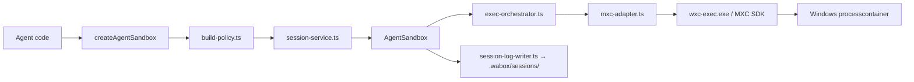
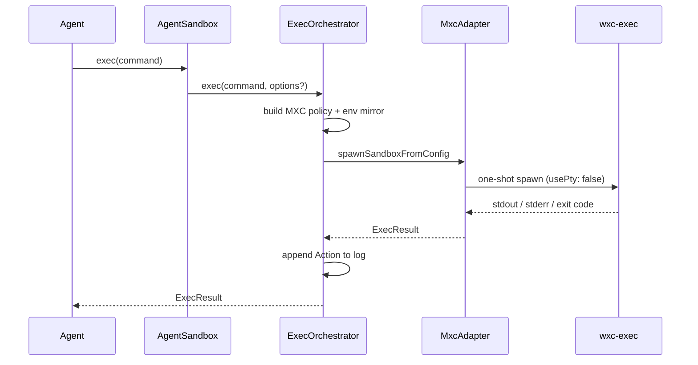

# WABOX

**Windows Agent Sandbox** — a TypeScript library that wraps [@microsoft/mxc-sdk](https://github.com/microsoft/mxc/blob/main/sdk/README.md) with an agent-friendly API for native Windows execution.

> **WABOX is** a blast-radius reducer for AI agents on Windows — presets, policy building, structured action logs, and one-shot command execution via MXC `processcontainer`. **It is not** a hardened security boundary, a WSL2 replacement, or a Docker competitor. **Primary interface:** `import { createAgentSandbox } from 'wabox'` in Node.js ≥ 18 on Windows 11 24H2+.

**Status:** MVP **0.1.0** — building in public. See [§10 Roadmap](#10-roadmap--build-history) for v2 and v3.

---

**TL;DR**

- Native Windows sandboxing via Microsoft's MXC SDK (`0.7.0-alpha`) — no WSL2 or Docker required for the sandbox path
- `createAgentSandbox()` + `exec()` + session JSON logs on `destroy()`
- One built-in preset today: `node-dev` (outbound network blocked by default)
- Each `exec()` is a fresh MXC spawn — shell state does not persist between calls
- `mirrorEnv: true | 'minimal' | false` — mirror host PATH for tools; `minimal` avoids slow DACL walks on AppContainer hosts
- Windows shim layer resolves `npm`/`npx`/`node` to absolute paths for MXC CreateProcess
- `getSupportStatus()` preflight — platform, MXC backend, isolation tier, warnings
- **6** unit test files + **1** gated integration test (`WABOX_INTEGRATION=1`)
- **5** public exports on the main entry; full types in `dist/index.d.ts`
- Docs: [MVP limitations](docs/MVP_LIMITATIONS.md), [decisions](docs/DECISIONS.md), [benchmarks](docs/BENCHMARK.md), [full spec](WABOX_SPEC.md)

---

## Table of contents

1. [What WABOX is and is not](#1-what-wabox-is-and-is-not)
2. [Requirements](#2-requirements)
3. [Architecture](#3-architecture)
4. [Quickstart](#4-quickstart)
5. [Configuration](#5-configuration)
6. [Public API](#6-public-api)
7. [Repository layout](#7-repository-layout)
8. [Development & testing](#8-development--testing)
9. [Documentation](#9-documentation)
10. [Roadmap & build history](#10-roadmap--build-history)
11. [License](#11-license)

---

## 1. What WABOX is and is not

| WABOX is | WABOX is not |
|----------|--------------|
| A TypeScript/Node.js library installable via npm | A hosted service or CLI product (yet) |
| A developer-experience layer on top of MXC | A replacement for MXC or a kernel sandbox |
| A blast-radius reducer for accidental agent damage | Defense against malicious model output or kernel attacks |
| Observable — structured action log + session JSON | Stateful multi-step shells in MVP (each `exec()` is one-shot) |
| Windows-native (`processcontainer` / AppContainer tier) | Cross-platform (Linux/macOS deferred) |

**Threat model (MVP):** wrong file deletes, rogue package installs, unbounded network exfiltration attempts — not nation-state adversaries. See [docs/MVP_LIMITATIONS.md](docs/MVP_LIMITATIONS.md).

---

## 2. Requirements

| Requirement | Detail |
|-------------|--------|
| OS | **Windows 11 24H2+** (build 26100+) |
| Node.js | **≥ 18** |
| MXC | `@microsoft/mxc-sdk` **0.7.0** (pinned); public preview |
| Host prep | On some hosts MXC selects **AppContainer + DACL** — elevated `wxc-host-prep prepare-system-drive` may be required once |

Call `getSupportStatus()` before `createAgentSandbox()` to surface MXC isolation tier and warnings.

---

## 3. Architecture

### 3.1 High-level flow



### 3.2 `exec()` lifecycle



### 3.3 Layer responsibilities

| Layer | Path | Role |
|-------|------|------|
| Public API | `src/index.ts` | Re-exports sandbox factory, support check, env helpers |
| Sandbox | `src/sandbox/agent-sandbox.ts` | `exec`, `getActionLog`, `destroy` |
| Services | `src/services/` | Session creation, exec orchestration |
| Policy | `src/policy/` | Preset merge, path sanitization, Windows command shims, MXC mapping |
| Infrastructure | `src/infrastructure/` | MXC adapter, env mirror, platform probe, dotenv |
| Presets | `src/presets/` | `node-dev` policy defaults |

**Key decision:** each `exec()` spawns a fresh sandbox (ADR-003 in [docs/DECISIONS.md](docs/DECISIONS.md)). Stateful sessions are planned for v2.

---

## 4. Quickstart

### 4.1 Install

```bash
npm install wabox @microsoft/mxc-sdk
```

From this repository (development):

```bash
git clone https://github.com/Vinayak-RZ/WABOX.git
cd WABOX
npm install
cp .env.example .env   # Windows: copy .env.example .env
npm run build
```

### 4.2 Minimal usage

```ts
import { createAgentSandbox, getSupportStatus } from 'wabox';

const status = getSupportStatus();
if (!status.supported) {
  throw new Error(status.errors.join('\n'));
}

const sandbox = createAgentSandbox({
  preset: 'node-dev',
  policy: {
    filesystem: { workspacePath: 'C:/path/to/your/project' },
  },
});

const result = await sandbox.exec('node -e "console.log(1+1)"');
console.log(result.stdout); // "2\n"

const log = await sandbox.destroy();
// Session JSON → .wabox/sessions/<sessionId>.json (local, gitignored)
```

### 4.3 Run the included example

```bash
npm run example
```

### 4.4 Preflight diagnose (development)

```bash
npm run diagnose
```

Runs `cmd`, `node -e`, and `npm --version` inside MXC with your `.env` policy — useful when AppContainer DACL or tool paths misbehave.

---

## 5. Configuration

Copy [`.env.example`](.env.example) to `.env` (gitignored). Programmatic overrides via `createAgentSandbox()` options still apply.

| Variable | Default | Purpose |
|----------|---------|---------|
| `WABOX_MIRROR_ENV` | `minimal` | PATH mirror: `minimal` (fast DACL), `full` (all PATH dirs), `none` (workspace only) |
| `WABOX_WORKSPACE_PATH` | — | Project root for agent read/write (forward slashes on Windows) |
| `WABOX_EXEC_TIMEOUT_MS` | `300000` | Per-exec timeout; first spawn on `appcontainer-dacl` can be slow |
| `WABOX_LOG_DIR` | `.wabox/sessions` | Session JSON output directory |
| `WABOX_DEBUG` | `0` | `1` = phased wxc-exec logs in `mxc-adapter.ts` |
| `WABOX_TOOLS_DIR` | — | If Node/npm live on a drive root, point to a subfolder (e.g. `D:/nodejs`) |
| `WABOX_DOCKER_IMAGE` | `node:22-alpine` | Benchmark script only |
| `WABOX_BENCHMARK_ITERATIONS` | `3` | Benchmark script only |
| `WABOX_INTEGRATION` | — | Set `1` to run Windows integration tests |

**Drive-root Node warning:** if `node.exe` sits at `D:\node.exe`, mirroring `D:\` can cause MXC DACL mutex hangs. Move tools into `D:\nodejs\` and set `WABOX_TOOLS_DIR=D:/nodejs`. See [docs/BENCHMARK.md](docs/BENCHMARK.md).

`mirrorEnv` on `createAgentSandbox()` accepts `true` (full), `'minimal'`, or `false` — see `src/infrastructure/env-mirror.ts`.

---

## 6. Public API

**Entry:** `src/index.ts` — **5** runtime exports + types.

### 6.1 Functions (5)

| Export | Source | What it does |
|--------|--------|--------------|
| `createAgentSandbox(options)` | `session-service.ts` | Create session, return `AgentSandbox` instance |
| `getSupportStatus()` | `platform.ts` | Preflight: Node version, platform, MXC support, isolation tier |
| `listPresets()` | `presets/registry.ts` | Returns `['node-dev']` in MVP |
| `readWaboxEnv()` | `wabox-env.ts` | Read `.env` / process env into typed config |
| `loadWaboxDotenv()` | `load-dotenv.ts` | Load `.env` from cwd (used by scripts) |

Also exported: `mergeAgentSandboxOptions`, `parseMirrorEnv`, `WaboxError`, `isWaboxError`, and TypeScript types.

### 6.2 `AgentSandbox` instance (4 methods)

| Method | What it does |
|--------|--------------|
| `exec(command, options?)` | Run one command in a fresh MXC spawn; returns `ExecResult` |
| `getActionLog()` | In-memory list of `Action` records for this session |
| `destroy()` | Write session JSON atomically, mark session ended |
| `buildSessionLog(endedAt)` | Build log object without persisting (internal/testing) |

Read-only: `sessionId`, `agentId`, `policy`, `mirroredEnv`, `logDir`, `destroyed`.

### 6.3 Presets (1)

| Preset | Network | Notes |
|--------|---------|-------|
| `node-dev` | Outbound blocked | Default timeout 120s; workspace paths merged at create time |

### 6.4 npm scripts (7)

| Script | Command | Purpose |
|--------|---------|---------|
| `build` | `tsc` | Compile to `dist/` |
| `test` | `vitest run` | Unit tests (CI-safe) |
| `test:integration` | `WABOX_INTEGRATION=1 vitest …` | Real MXC spawns on Windows |
| `example` | `tsx examples/minimal-agent.ts` | Smoke test |
| `diagnose` | `tsx scripts/diagnose-mxc.ts` | cmd + node + npm preflight |
| `spike` | `tsx scripts/mxc-spike.ts` | Raw MXC Phase 0 probe |
| `benchmark` | `tsx scripts/benchmark-wabox-vs-docker.ts` | WABOX vs Docker timing (local) |

---

## 7. Repository layout

```
WABOX/
├── src/
│   ├── index.ts              # Public exports
│   ├── sandbox/              # AgentSandbox class
│   ├── services/             # Session + exec orchestration
│   ├── policy/               # Policy builder, Windows shims, MXC mapping
│   ├── infrastructure/       # MXC adapter, env mirror, platform, logging
│   ├── presets/              # node-dev preset + registry
│   └── domain/               # Types, errors, path utils
├── tests/                    # 6 unit + 1 integration
├── scripts/                  # diagnose, benchmark, spike, bootstrap-env
├── examples/minimal-agent.ts
├── docs/                     # Published documentation
│   ├── MVP_LIMITATIONS.md
│   ├── DECISIONS.md
│   └── BENCHMARK.md
├── WABOX_SPEC.md             # Full product specification (v1–v3)
├── .env.example
└── package.json
```

**Local only (gitignored, not on the public remote):** `.wabox/` (runtime logs), `learning/` (personal notes), `.cursor/` (editor config), `AGENTS.md`, `.env`.

---

## 8. Development & testing

```bash
npm run build
npm test                    # 6 unit test files
npm run test:integration    # requires Windows + WABOX_INTEGRATION=1 + working MXC host
```

| Test file | Covers |
|-----------|--------|
| `tests/policy/build-policy.test.ts` | Preset merge, workspace paths |
| `tests/policy/sanitize-paths.test.ts` | Path normalization |
| `tests/policy/resolve-tool-paths.test.ts` | Tool directory resolution |
| `tests/policy/windows-command.test.ts` | npm/npx/cmd shim layer |
| `tests/policy/session-log-writer.test.ts` | Atomic JSON write |
| `tests/infrastructure/wabox-env.test.ts` | Env parsing |
| `tests/integration/sandbox.test.ts` | End-to-end spawn (gated) |

**Host prep** (when `getSupportStatus().isolationWarnings` mention system drive):

```powershell
# Elevated PowerShell — ships with @microsoft/mxc-sdk
wxc-host-prep prepare-system-drive
wxc-host-prep prepare-null-device
```

---

## 9. Documentation

| Document | Purpose |
|----------|---------|
| [docs/MVP_LIMITATIONS.md](docs/MVP_LIMITATIONS.md) | Honest list of what 0.1.0 does *not* do |
| [docs/DECISIONS.md](docs/DECISIONS.md) | Architecture decision records |
| [docs/BENCHMARK.md](docs/BENCHMARK.md) | WABOX vs Docker benchmark methodology and results |
| [WABOX_SPEC.md](WABOX_SPEC.md) | Full product spec — API design, presets, eval, network, v1–v3 |

---

## 10. Roadmap & build history

### 10.1 Shipped — MVP 0.1.0 (building in public)

| Phase | Theme | Status |
|-------|-------|--------|
| 0 | MXC spike (`wxc-exec`, Windows quoting) | ✅ |
| 1 | Policy builder + `node-dev` preset + env mirror | ✅ |
| 2 | `MxcAdapter` + `ExecOrchestrator` (`usePty: false`) | ✅ |
| 3 | `createAgentSandbox`, action log, session JSON on `destroy()` | ✅ |
| 4 | `getSupportStatus`, docs, minimal example | ✅ |
| 4b | `.env` config, `minimal` PATH mirror, Windows npm/node shims | ✅ |
| 4c | `diagnose` + `benchmark` scripts, benchmark docs | ✅ |

**What works today:**

- `createAgentSandbox` with `node-dev` preset and custom `WaboxPolicy`
- One-shot `exec()` per command via MXC `processcontainer`
- Structured `Action` log + atomic session JSON
- `mirrorEnv`: full / minimal / none
- Platform preflight with isolation tier and warnings
- Unit tests + optional integration tests

**Explicitly deferred from full v1 spec** (see [WABOX_SPEC.md §14](WABOX_SPEC.md#14-v1--core)):

- Additional presets (`python-dev`, `read-only`, `offline`, …)
- Risk classification and approval gates
- Eval reports and anomaly detection
- Network proxy allowlist/blocklist mode
- `npx wabox setup` / `doctor` CLI
- Credential `inject` and dev-server port helpers

### 10.2 v2 — Hardened & observable

Goal: real network enforcement, longer-lived sessions, richer observability. See [WABOX_SPEC.md §15](WABOX_SPEC.md#15-v2--hardened--observable).

| Feature | Summary |
|---------|---------|
| Windows Firewall network mode | `enforcement: 'firewall'` — not bypassable by raw sockets |
| Stateful sessions | MXC `isolation_session` backend when stable — `npm install` then `npm test` in one sandbox |
| Session snapshots | Checkpoint and branch exploration paths |
| Enhanced network observability | Per-process domain/port attempts in action log |
| Eval improvements | Trend analysis, baselines, CI export formats |
| Custom risk rules | `defineRiskRule()` for project-specific patterns |

### 10.3 v3 — Swarm & orchestration

Goal: multi-agent architectures with shared policy and aggregate eval. See [WABOX_SPEC.md §16](WABOX_SPEC.md#16-v3--swarm--orchestration).

| Feature | Summary |
|---------|---------|
| `createSwarmSession()` | Parent session coordinating isolated child sandboxes |
| Shared workspace | Controlled read/write across workers with conflict detection |
| Policy inheritance | Children extend or restrict parent policy |
| Aggregate eval | Cross-child anomalies and swarm-level verdict |
| Risk escalation chain | Child approvals bubble to orchestrator |
| AI-powered eval (experimental) | Semantic session review via LLM — opt-in, non-deterministic |

### 10.4 Changelog (recent)

| Date | Change |
|------|--------|
| 2026-06 | MVP 0.1.0: core sandbox API, `node-dev`, session logs, Windows shims |
| 2026-06 | Minimal PATH mirror + `.env` configuration for DACL performance |
| 2026-06 | Open-source prep: public README, docs retained; local `learning/` and `.cursor/` excluded from remote |

---

## 11. License

MIT — see [package.json](package.json).
