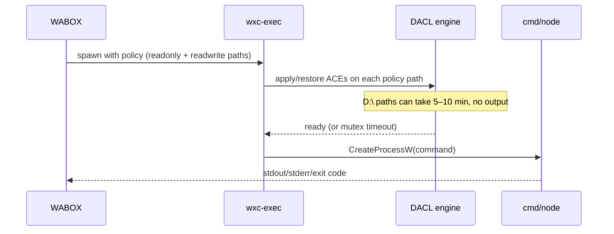

# MXC DACL & performance on Windows — problem guide

This document explains **what is going wrong** on hosts like yours (`D:\` workspace, MXC `appcontainer-dacl` tier), **why** warmup can succeed while diagnose still hangs, and **what we can do about it**.

**Audience:** WABOX developers on Windows 11 with workspace on a non-system drive (e.g. `D:/Tech/WABOX`).

---

## 1. Executive summary

WABOX is not “slow” in the usual sense. **Microsoft MXC** (`wxc-exec.exe`) applies **filesystem DACLs** (access control entries) on every path in the sandbox policy before the command runs. On the **AppContainer + DACL** isolation tier, that setup can take **5–10 minutes** with **zero stdout/stderr** on the first spawn for a given policy shape — especially when paths live on **`D:\`**.

You have **three separate problems**, not one:

| # | Symptom | Cause |
|---|---------|--------|
| A | First `exec()` after reboot takes many minutes | MXC cold **DACL walk** on `D:\` policy paths |
| B | `npm run warmup` OK, then `diagnose` still times out at 300s | **Warmup flag does not track policy** — new readwrite path (`.wabox\tmp`) needs a fresh DACL walk; diagnose used 300s not 900s because warmup said “already warmed” |
| C | `node` fails in ~3s with `0xC0000142` | **Direct `node.exe` spawn** fails AppContainer init (separate from DACL timeout); mitigated with `WABOX_NODE_VIA_CMD=1` |

Host prep (`prepare-system-drive`, `prepare-null-device`) is **already OK** on your machine. The remaining pain is **MXC DACL cost + policy churn + node launch path**.

---

## 2. Your host (reference)

From `latest.json` and terminal logs (2026-06-30):

| Item | Value |
|------|--------|
| OS | Windows 11 24H2 (`10.0.26200`) |
| MXC tier | `appcontainer-dacl` (BaseContainer/BFS not available in this MXC build) |
| Node | `D:\nodejs\node.exe` v24.14.0 |
| Workspace | `D:/Tech/WABOX` |
| Host prep | `C:\` and `D:\` AppContainer ACEs ✓, `\Device\Null` ✓ |
| Policy readonly | `D:\nodejs`, Git cmd, System32, SysWOW64 |
| Policy readwrite | `D:\Tech\WABOX`, `D:\Tech\WABOX\.wabox\tmp` |
| `WABOX_EXEC_TIMEOUT_MS` | 300000 (5 min) |

---

## 3. How MXC sandboxing works (why it feels broken)



**Important:**

- **Each `sandbox.exec()`** is a **new** MXC one-shot spawn (MVP) — not a persistent shell.
- MXC work happens **before** your command prints anything.
- DACL cost is tied to the **set of filesystem paths** in the policy, not just “first boot of the day”.

---

## 4. Problem A — Cold DACL on `D:\`

### What you see

- `cmd /c echo` hangs with **no output** for minutes.
- Debug logs show `D:\ cold DACL in progress (NNNs)…`
- Often fails with `EXEC_TIMEOUT` at **300000ms** if timeout is too short.

### Why

Your workspace and tools are on **`D:\`**. MXC must grant AppContainer-compatible DACLs on:

- `D:\Tech\WABOX` (readwrite)
- `D:\Tech\WABOX\.wabox\tmp` (readwrite temp)
- `D:\nodejs` (readonly)

`prepare-system-drive --target D:\` only adds **drive-root metadata** ACEs. It does **not** remove per-directory DACL work MXC does on first use of each policy path.

### Evidence from this repo

| Run | First `cmd` spawn | After warm |
|-----|-------------------|------------|
| Benchmark Run 2 | ~274 s | ~1.4 s |
| Your warmup (2026-06-30) | ~440 s | — |
| Your diagnose after warmup | timed out **305 s** | (see Problem B) |

---

## 5. Problem B — “Warmup succeeded” but diagnose still cold

### What happened in your latest session

1. `npm run warmup` → **✓** ~440s, `warmup-ok`
2. `npm run diagnose` → shows **`boot warmup: ✓ already warmed`**
3. First test `cmd /c echo` → **305s EXEC_TIMEOUT** (zero output)

### Why — the false “warmed” signal

Warmup today only stores:

```json
{ "warmedAt": "...", "bootUptimeAtWarm": 12345, "durationMs": 439692, "command": "..." }
```

It does **not** store which **policy paths** were warmed.

When we changed temp from `%TEMP%` (`AppData\Local\Temp`) to **`D:\Tech\WABOX\.wabox\tmp`**, the policy gained a **new readwrite path**. MXC treats that as **new DACL work** — but:

- `isBootWarmed()` still returned **true** (same Windows boot session)
- `resolveExecTimeoutMs()` therefore used **300s**, not **900s**
- DACL was still running → **timeout at 305s**

So: **warmup warmed an older policy shape; diagnose used a new one with a short timeout.**

### Fix (shipped)

Warmup now stores a **policy filesystem fingerprint** (`src/policy/policy-fingerprint.ts`). `isBootWarmedForPolicy()` returns true only when boot session **and** policy paths match. Diagnose shows **stale** when they differ and extends cold timeout again.

---

## 6. Problem C — `AppData\Local` DACL mutex (fixed in code, historical)

Earlier probes showed wxc-exec stderr:

```text
timed out acquiring DACL mutex on \\?\C:\Users\vinay\AppData\Local after 30000 ms
```

**Cause:** MXC’s default temp path `%TEMP%` → `AppData\Local\Temp` in **readwrite** policy. DACL mutex contention on `AppData\Local` caused failures and multi-minute stalls.

**Fix shipped:** default sandbox temp is now **`{workspace}/.wabox/tmp`** (see `src/policy/sandbox-temp.ts`).

**Trade-off:** new path under `D:\` → **one more DACL cold walk** when that path first appears in policy. After that walk completes once for this policy, spawns should be fast.

---

## 7. Problem D — `node` exits `0xC0000142` (STATUS_DLL_INIT_FAILED)

### What you see

- `cmd /c echo` can pass (~3s when DACL warm)
- `node -e "console.log(42)"` fails in **~3s**, exit **`3221225794` (`0xC0000142`)**, no stdout

### Why

This is **not** a timeout. The sandboxed process **starts** then **dies during DLL/process init** inside AppContainer.

Common on this tier when:

- Launching **`node.exe` directly** via CreateProcessW
- AppContainer cannot access something Node needs at load time

**Mitigation (opt-in):** `WABOX_NODE_VIA_CMD=1` — run node through `cmd /c` (same pattern as `npm`).

**Also fixed:** `npm` was resolving to extensionless `D:\nodejs\npm` instead of `npm.cmd`.

**Expand mirror** (`WABOX_EXPAND_NODE_MIRROR=1`) did **not** fix `0xC0000142` on baseline; adding many profile paths made DACL **worse**.

---

## 8. What is *not* the problem

| Ruled out | Evidence |
|-----------|----------|
| Missing `C:\` / `D:\` drive ACEs | diagnose host prep ✓ count=2 |
| Missing null device | `verify-null-device` exit 0 |
| MXC unsupported | `isSupported: true`, `processcontainer` |
| Node not found | resolves to `D:\nodejs\node.exe` |
| Full PATH mirror slowness | using `minimal` mirror (4 readonly paths) |

---

## 9. Possible solutions (ranked)

### Tier 1 — Do now (no code changes)

| Action | Effect |
|--------|--------|
| Set `WABOX_EXEC_TIMEOUT_MS=900000` in `.env` | Survive 5–10 min cold DACL without false timeout |
| Run `npm run warmup` **after any policy change** | One long wait; then fast iterates |
| Keep `WABOX_NODE_VIA_CMD=1` | Addresses `0xC0000142` for node |
| Do not kill `wxc-exec` mid-DACL | Prevents mutex stalls (pid 27260-style errors) |

### Tier 2 — Code / workflow (shipped or planned)

| Action | Status |
|--------|--------|
| Workspace temp `.wabox/tmp` instead of `%TEMP%` | ✅ Shipped |
| `npm.cmd` resolution | ✅ Shipped |
| `cmd /c` quoting fix | ✅ Shipped |
| **Policy fingerprint in warmup** | ✅ Shipped — warmup invalid if paths change |
| `npm run probe:node` / `probe-node-quick.ts` | ✅ Shipped for experiments |

### Tier 3 — Structural (best long-term dev UX)

| Action | Effect |
|--------|--------|
| **Move workspace to `C:\`** (e.g. `C:\dev\WABOX`) | Avoids `D:\` DACL cold start; largest win |
| **Junction** `C:\dev\WABOX` → `D:\Tech\WABOX` for MXC policy only | Tricky — MXC may still resolve target |
| Elevated `setup-mxc-host.ps1 -RegisterLogonTask` | Auto `prepare-null-device` each logon |
| Wait for MXC **BaseContainer/BFS** tier | Fewer DACL mutations (depends on MXC build/OS) |

### Tier 4 — Not recommended

| Action | Why |
|--------|-----|
| `WABOX_EXPAND_NODE_MIRROR=1` with full profile dirs | More paths → longer DACL; did not fix node |
| `WABOX_USE_SYSTEM_TEMP=1` | Brings back `AppData\Local` mutex issues |
| Mirroring bare `D:\` drive root | MXC hangs / mutex (documented in BENCHMARK.md) |

---

## 10. Recommended dev workflow (today)

```powershell
# 1. One-time elevated (per machine + D:\)
.\scripts\setup-mxc-host.ps1 -ExtraDrives D:\ -RegisterLogonTask

# 2. .env
# WABOX_EXEC_TIMEOUT_MS=900000
# WABOX_NODE_VIA_CMD=1
# WABOX_MIRROR_ENV=minimal

# 3. After reboot OR after pulling policy changes
npm run warmup    # wait 5–10 min; do not interrupt

# 4. Then
npm run diagnose
npm run example
```

If warmup says “already warmed” but diagnose hangs on step 1 → **policy changed since warmup**. Run warmup again with `900000` ms timeout, or delete `.wabox/warmup.json`.

---

## 11. Success criteria

| Check | Target |
|-------|--------|
| `cmd /c echo` | < 5s after warmup with **same** policy |
| `node -e` | exit 0 with `WABOX_NODE_VIA_CMD=1` |
| `npm --version` | exit 0, non-empty stdout |
| No `AppData\Local` in readwrite policy | unless `WABOX_USE_SYSTEM_TEMP=1` |

---

## 12. References in this repo

| File | Topic |
|------|--------|
| [docs/BENCHMARK.md](./BENCHMARK.md) | Measured cold vs warm times on this host |
| [docs/MVP_LIMITATIONS.md](./MVP_LIMITATIONS.md) | MVP scope, host prep |
| [scripts/warmup-mxc.ts](../scripts/warmup-mxc.ts) | DACL warmup command |
| [scripts/setup-mxc-host.ps1](../scripts/setup-mxc-host.ps1) | Elevated host prep |
| [src/policy/sandbox-temp.ts](../src/policy/sandbox-temp.ts) | Workspace temp path |
| [Microsoft MXC host-prep](https://github.com/microsoft/mxc/blob/main/docs/host-prep.md) | `prepare-system-drive`, `prepare-null-device` |

---

## Changelog

| Date | Note |
|------|------|
| 2026-06-30 | Initial doc — false warmup / `.wabox\tmp` policy churn / 0xC0000142 |
