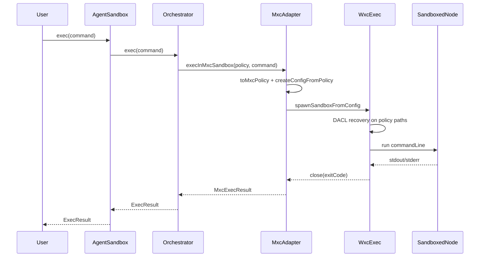

# Exec Flow — One Command End to End

Trace: `await sandbox.exec('node -e "console.log(1)"')`

---

## 1. User calls `exec`

**File:** `src/sandbox/agent-sandbox.ts`

- Checks session not destroyed
- Delegates to `ExecOrchestrator`

---

## 2. Orchestrator records the action

**File:** `src/services/exec-orchestrator.ts`

- `actionId = 1` (increments each exec)
- `timestamp = now`
- Calls `execInMxcSandbox(policy, command, options)`

---

## 3. Build MXC policy for this command

**File:** `src/infrastructure/mxc-adapter.ts` → `src/policy/to-mxc-policy.ts`

- Merge session `WaboxPolicy` with command-specific rules
- If command contains PowerShell → `ui.allowWindows: true`
- Set `version: '0.7.0-alpha'`

---

## 4. Create spawn config

**File:** `src/infrastructure/mxc-adapter.ts`

```text
createConfigFromPolicy(mxcPolicy, 'process')
config.process.commandLine = quoteWindowsCommandLine(command)
config.process.timeout = timeoutMs
```

**File:** `quoteWindowsCommandLine` — quotes `C:\Program Files\...\node.exe` if needed.

---

## 5. Spawn wxc-exec

**File:** `src/infrastructure/mxc-adapter.ts`

```text
child = spawnSandboxFromConfig(config, { usePty: false })
child.stdin.end()   // important — wxc-exec waits for EOF otherwise
```

**Process tree:**

```text
node (your script)
  └── wxc-exec.exe (MXC)
        └── node.exe (sandboxed, inside policy)
```

---

## 6. Wait for output

**Events:**
- `stdout` / `stderr` data chunks appended
- `close` with exit code → resolve
- Timer fires → `WaboxError EXEC_TIMEOUT`, kill child

With `WABOX_DEBUG=1`, heartbeat logs every 10s during wait.

---

## 7. Return to orchestrator

**File:** `src/services/exec-orchestrator.ts`

Build `Action` object, push to `actions[]`, return:

```ts
{ exitCode, stdout, stderr, durationMs, actionId }
```

---

## 8. On `destroy()` (separate call)

**File:** `src/sandbox/agent-sandbox.ts` → `session-log-writer.ts`

- Build `SessionLog` from context + actions
- Write `.wabox/sessions/{sessionId}.json` atomically

---

## Where time is spent (typical)

```text
createAgentSandbox()     ~ fast (policy build in JS)
exec() first call        ~ slow (wxc-exec DACL + spawn)  ← benchmark "hang"
exec() later calls       ~ often faster (warm DACL cache)
destroy()                ~ fast (single JSON write)
```

---

## Mermaid sequence


